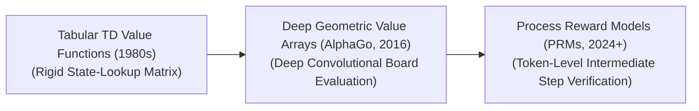

# Awesome-Value-Networks
## Value Networks in AI: History, Progression, Variants, & Applications

A Value Network is a specialized neural network architecture designed to estimate the expected cumulative future reward, utility, or winning probability from a given state or state-action pair. While **Policy Networks** act as the intuitive engine that directly outputs an action vector, Value Networks serve as the analytical evaluation engine—quantifying the structural strength of a position. Over the history of AI, Value Networks have evolved from simple tabular lookups to deep convolutional estimators, generalized state-space value functions, and highly precise **Process-Supervised Step Verifiers** that guide post-training scaling and test-time search algorithms in modern frontier reasoning models.

---

## 1. The Macro Chronological Evolution

The technical progression of state-valuation layers has transitioned from rigid matrix lookups to deep grid heuristics, maximum entropy state mappings, and multi-step process reward models.

| Era / Stage | Key Concept & Description | Year First Used | First Used Paper |
| :--- | :--- | :--- | :--- |
| **The Foundational Tabular Era (Temporal Difference Learning, ~1980s–2010s)** | The structural baseline. Early frameworks mapped out environment utilities using basic temporal difference (TD) errors or tabular $Q$-learning matrices. The system maintained a discrete, hand-crafted state-lookup grid, updating expected values step-by-step as an agent navigated small grid worlds.    *Limitation:* Suffered heavily from the **Curse of Dimensionality**. If the state space scaled up (e.g., in a complex board game), the table size exploded, causing the system to experience severe memory and capacity bottlenecks. | 1988 | [Learning to predict by the methods of temporal differences](https://link.springer.com/article/10.1007/BF00115009) |
| **The Deep Geometric Board Evaluation Era (AlphaGo / Deep Q-Networks, ~2016–2022)** | Merged state-valuation loops with deep neural networks. In Deep $Q$-Networks (DQN), convolutional layers replaced lookup tables, mapping raw screen pixels straight to expected rewards. This peaked with **AlphaGo / AlphaZero (2016)**, which deployed a dedicated deep Convolutional Value Network to evaluate millions of board states simultaneously, replacing thousands of pages of hand-crafted human chess/Go heuristics with a unified scalar probability of winning. | 2015 | [Human-level control through deep reinforcement learning](https://www.nature.com/articles/nature14236) |
| **The Process-Supervised Step Verifier Era (~2024–Present)** | The current modern state-of-the-art frontier standard. Extends past simple reward tracking to evaluate multi-step textual tokens in reasoning architectures (such as OpenAI's o1/o3 and DeepSeek-R1 series). Instead of scoring only the final outcome of an answer (Outcome Reward Models - ORMs), the value network acts as a **Process-Supervised Reward Model (PRM)**, evaluating the mathematical and logical correctness of *each individual intermediate reasoning step* during the model's hidden thinking phase. | 2022 | [Solving math word problems with process-based feedback](https://arxiv.org/abs/2211.14275) |

---

## 2. Core Functional & State-Valuation Variants

Value Networks are strictly categorized based on the explicit mathematical inputs and boundaries they parse across the optimization pipeline.

| Variant | Mechanism & Application | Year First Used | First Used Paper |
| :--- | :--- | :--- | :--- |
| **State-Value Networks ($V(s)$)** | **Mechanism:** Evaluates the absolute utility of a physical state $s$ under a given policy baseline, outputting a scalar value indicating how safe, advantageous, or high-yielding that position is intrinsically.  **Application:** Serves as the baseline calculator inside Advantage Actor-Critic (A2C) networks, suppressing gradient variance during policy updates. | 1983 | [Neuronlike adaptive elements that can solve difficult learning control problems](https://ieeexplore.ieee.org/document/6313077) |
| **Action-Value Networks ($Q(s, a)$)** | **Mechanism:** Evaluates the quality of taking a specific action $a$ from a specific state $s$. The network maps out a full action-value coordinate field, allowing an agent to select paths by following the highest-scoring vector.  **Application:** The defining layer behind continuous continuous-control models like Deep Deterministic Policy Gradients (DDPG). | 1989 | [Learning from Delayed Rewards](http://www.richsutton.com/watkins-1989.pdf) |
| **Soft Value Functions (Maximum Entropy)** | **Mechanism:** Augments traditional reward calculations with information theory, adding an explicit policy entropy regularizer ($\alpha H(\pi(\cdot\|s))$) into the value layer.  **Pros:** Prevents premature policy collapse by continually rewarding the agent for maintaining diverse, alternative behavioral strategies during exploration blocks. | 2018 | [Soft Actor-Critic: Off-Policy Maximum Entropy Deep Reinforcement Learning with a Stochastic Actor](https://arxiv.org/abs/1801.01290) |
| **Process-Supervised Reward Models (PRMs / Token Verifiers)** | **Mechanism:** Operates over textual token spaces. The input is a sequence of generated reasoning tokens representing a single thinking step, and the model outputs a probability score indicating whether that specific deduction step contains any logical or mathematical errors. | 2022 | [Solving math word problems with process-based feedback](https://arxiv.org/abs/2211.14275) |

---

## 3. Inference-Time Search & Verification Modalities

Depending on how a Value Network interfaces with an exploration graph at runtime, it guides choices through distinct computational layouts.

[Current State Prompt] --(Policy Heads)--> [Branching Candidate Paths] --(Value Network Evaluation)--> [MCTS Path Selection]

| Search / Verification Modality | Profile | Year First Used | First Used Paper |
| :--- | :--- | :--- | :--- |
| **Monte Carlo Tree Search (MCTS) Evaluation** | Pairs the Value Network with a symbolic tree-search algorithm. The network evaluates candidate branch paths generated by a policy network, pruning away low-scoring trajectories early to guide exploration toward high-probability horizons. | 2006 | [Efficient Selectivity and Memory Simplification in Monte-Carlo Tree Search](https://link.springer.com/chapter/10.1007/11925910_22) |
| **Best-of-N Sampling & Reranking** | Generates $N$ independent, parallel reasoning or text paths simultaneously at a high decoding temperature. The value network evaluates and ranks all $N$ options, filtering out hallucinations and selecting the highest-utility response before user serving occurs. | 2021 | [Training Verifiers to Solve Math Word Problems](https://arxiv.org/abs/2110.14168) |
| **Inference-Time Lookahead Pruning** | Deployed inside real-time continuous control stacks. The value network projects finite future horizons, instantly blocking the agent from selecting any directional path that routes the system into an absolute failure state. | 2018 | [Plan Online, Learn Offline: Efficient Learning and Quasi-Static Training with Model Predictive Control](https://arxiv.org/abs/1811.01859) |

---

## 4. Production Engineering Challenges & Hardware Solutions

Translating value network computations into stable, low-latency commercial frameworks introduces unique system bottlenecks.

| Challenge | The Problem & Mitigation | Year First Used | First Used Paper / Technology |
| :--- | :--- | :--- | :--- |
| **The Moving Target and Overestimation Bias Bottleneck** | **The Problem:** During optimization, value networks recursively look up their own future predictions to update current parameters (bootstrapping). This creates a destructive feedback loop where the model systematically overestimates expected rewards, resulting in training instability and parameter divergence.  **Mitigation:** Implementing **Target Networks ($\theta^-$)**—maintaining a separate, slow-moving copy of the value weights updated via exponential moving averages (Polyak averaging)—coupled with **Twin-Critic architectures (TD3 style)** that use the minimum score of two parallel networks to neutralize overestimation bias. | 2015 | [Human-level control through deep reinforcement learning](https://www.nature.com/articles/nature14236) |
| **High Test-Time Search Compute Latency** | **The Problem:** Querying a massive, deep value network repeatedly at every step of a tree-search or token-generation loop introduces severe Time-to-First-Token (TTFT) delays, making the system unviable for high-volume concurrent streaming.  **Mitigation:** Compiling value network pipelines into highly optimized **Fused Hardware Kernels (Triton / TensorRT)**, or distilling large, deep reward networks down into compact linear structural heads appended directly onto the baseline model graph. | 2019 | [Triton: an intermediate language and compiler for tiled neural network computations](https://dl.acm.org/doi/10.1145/3318170.3318198) |

---

## 5. Frontier Real-World AI Infrastructure Applications

| Application Field | Description & Utility | Year First Used | First Used Paper |
| :--- | :--- | :--- | :--- |
| **Step-Level Alignment for Large Reasoning Models** | Serves as the evaluation engine for large-scale Reinforcement Learning (RL) pipelines training reasoning models. Process-Supervised Value Networks (PRMs) scan intermediate mathematical proofs, code syntax blocks, and symbolic identities, rewarding flawless multi-step reasoning steps while penalizing logical errors instantly. | 2023 | [Let's verify step by step](https://arxiv.org/abs/2305.20050) |
| **Autonomous Flight and Humanoid Locomotion Guidance Loops** | Stabilizes real-time kinetic navigation for bipedal humanoids, drones, or spacecraft docking systems. Deep value networks evaluate physical environment arrays at high frequencies, computing safe joint-torque boundaries to help the machine cross volatile, shifting debris fields stably. | 2019 | [Learning agile and dynamic motor skills for legged robots](https://www.science.org/doi/10.1126/science.aau5872) |
| **High-Volume Quantitative Portfolio Risk Management** | Orchestrates global algorithmic trading strategies across volatile multi-asset financial landscapes. Distributed value networks track systemic market covariance parameters and macro-economic metrics, evaluating the expected risk profile of proposed asset distributions to adjust stop-loss parameters automatically before market execution. | 2001 | [Learning to trade with reinforcement learning](https://ieeexplore.ieee.org/document/912176) |

---

## References
1. Sutton, R. S., & Barto, A. G. (1998). *Reinforcement learning: An introduction*. MIT Press.
2. Mnih, V., et al. (2015). Human-level control through deep reinforcement learning. *Nature*, 518(7540), 529-533.
3. Silver, D., et al. (2016). Mastering the game of Go with deep neural networks and tree search. *Nature*, 529(7587), 484-489.
4. Haarnoja, T., et al. (2018). Soft actor-critic: Off-policy maximum entropy deep reinforcement learning with a stochastic actor. *International Conference on Machine Learning (ICML)*, 1861-1870.
5. Uesato, J., et al. (2022). Solving math word problems with process-based feedback. *arXiv preprint arXiv:2211.14275*.
6. Lightman, H., et al. (2023). Let's verify step by step. *arXiv preprint arXiv:2305.20050*.

---

To advance your development context, repository architecture, or documentation framework, consider pursuing these adjacent research paths:
* Build a **Python script using PyTorch** to construct a functional Value Network module capable of estimating advantage parameters from raw tensor inputs.
* Generate a **comprehensive Markdown table** explicitly mapping Outcome Reward Models (ORMs), Process-Supervised Reward Models (PRMs), Tabular Q-tables, and Soft Value Functions across computational overhead, target optimization losses, and error tolerance bounds.
* Establish a **performance profiling notebook using Triton** to evaluate the exact wall-clock throughput difference of executing a fused reward-head estimation pass directly within fast GPU SRAM registers versus independent multi-layer matrix lookups.

***

**Related Topics**: To expand your understanding of structured cognitive architectures, check out these related documentation sets:
* For details on how value signals guide actions, read **[Actor-Critic Architectures in AI](#)**.
* To see how value trees are traversed at runtime, check out **[Tree-of-Thoughts (ToT) Frameworks](#)**.
* To master the training mechanics used to align value estimators, explore **[Reinforcement Learning from Human Feedback (RLHF)](#)**.

