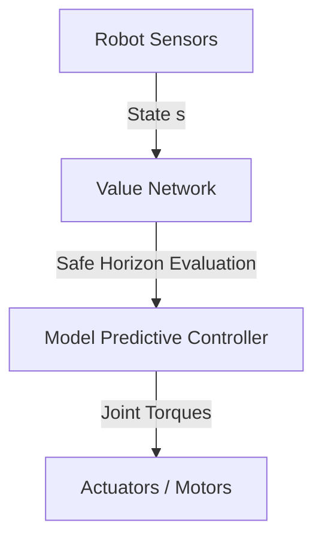

# Autonomous Flight and Humanoid Locomotion Guidance Loops

In physical robotics, value networks serve as critical components for calculating control stability and safe flight trajectories under high-frequency constraints.

### Key Concepts
- **Joint-Torque Boundaries:** Estimating viability of dynamic foot placements or aerodynamic states.
- **High-Frequency Stacks:** Combining low-level high-frequency controllers with high-level value-guided path planning.

### System Diagram

