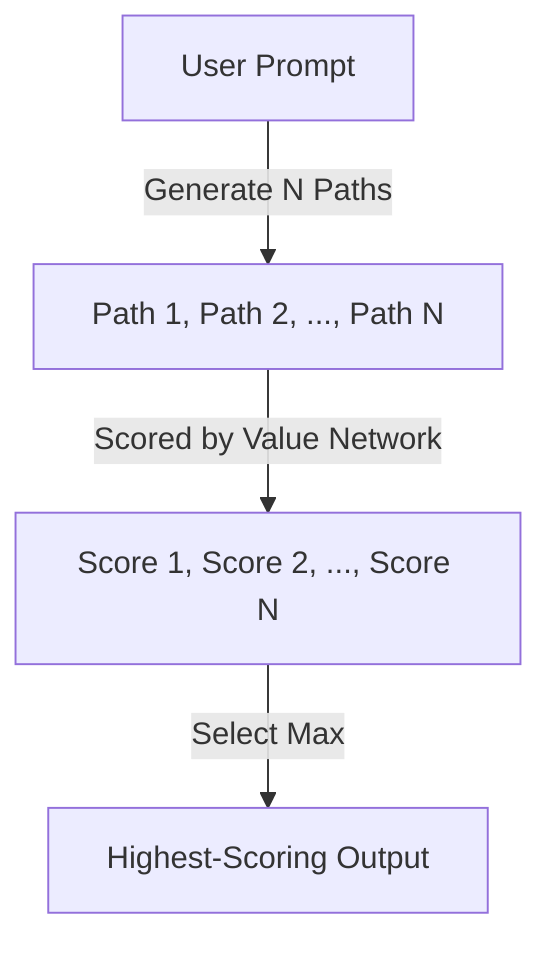

# Best-of-N Sampling & Reranking

Best-of-N sampling (or reranking) is a inference-time generation strategy where multiple candidates are sampled and then scored using a reward model.

### Key Concepts
- **Generative Sampling:** Generate $N$ diverse paths using a language model.
- **Value Scoring:** Use a value network or PRM to score each path.
- **Selection:** Serve the path with the highest score.

### System Diagram

