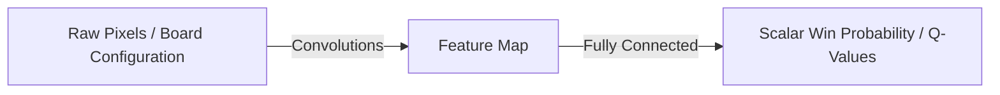

# The Deep Geometric Board Evaluation Era (AlphaGo / Deep Q-Networks)

This era combined value estimation with deep convolutional neural networks (CNNs), allowing RL agents to scale to high-dimensional state spaces like pixel inputs or complex board configurations without manual feature engineering.

### Key Concepts
- **Deep Q-Networks (DQN):** Approximating $Q(s, a)$ using multi-layer neural networks (CNNs) trained with experience replay and target networks.
- **Geometric Board Evaluation:** In AlphaGo, a Value Network was trained to evaluate board states by treating the Go board as an image grid, extracting spatial features to predict the final winning probability.

### System Diagram

