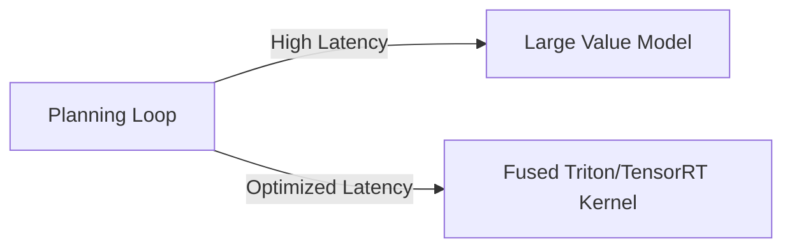

# High Test-Time Search Compute Latency

Running deep neural networks repeatedly inside high-frequency planning loops (like MCTS or token generation) introduces significant latency bottlenecks.

### Key Concepts
- **Kernel Fusion:** Compiling matrix operations into custom Triton or TensorRT kernels to maximize memory bandwidth.
- **Model Distillation:** Distilling large evaluation models into smaller, faster architectures or single linear heads.

### System Diagram

