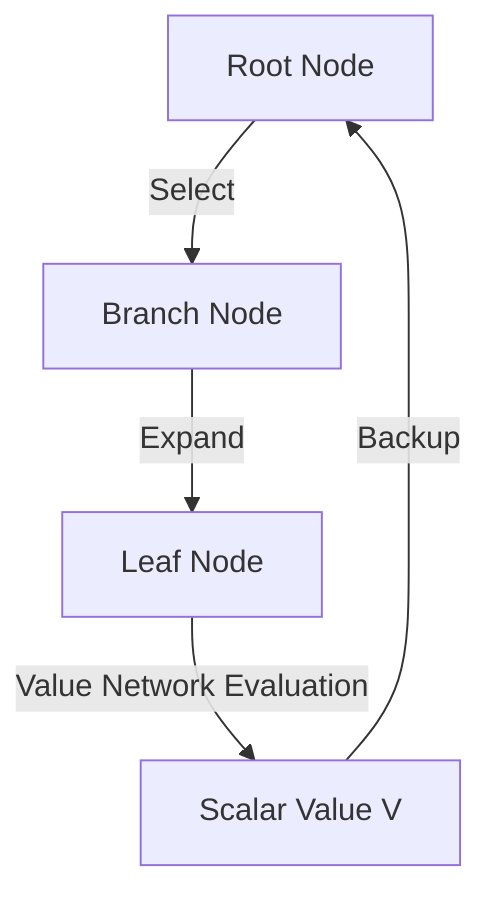

# Monte Carlo Tree Search (MCTS) Evaluation

MCTS combined with Value Networks allows agents to plan ahead by looking into future scenarios, utilizing the value network to evaluate non-terminal states.

### Key Concepts
- **Selection & Expansion:** Traversed using a policy network.
- **Evaluation:** Value networks evaluate new leaf states directly, replacing long rollouts.
- **Backup:** Updating values of visited nodes along the trajectory path.

### System Diagram

