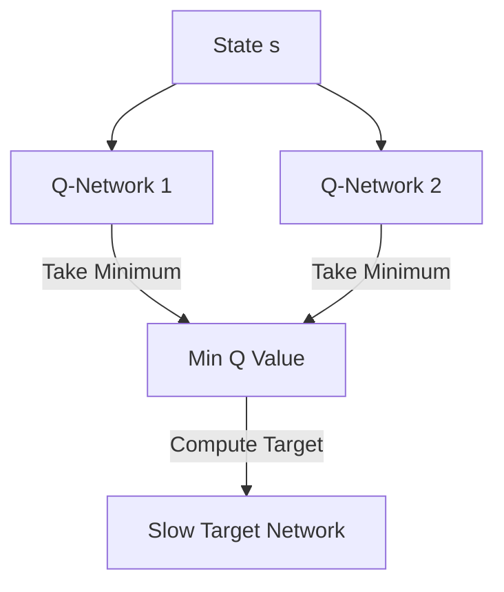

# The Moving Target and Overestimation Bias Bottleneck

A core engineering challenge in value learning is that updating a value network using bootstrapping creates a moving target and propagates overestimation errors.

### Key Concepts
- **Bootstrapping:** Updating $Q(s, a)$ towards $r + \gamma \max_{a'} Q(s', a')$.
- **Overestimation Bias:** Systematic overestimation of action-values due to the maximization operator.
- **Target Networks:** Using a slow-updating copy of the network to compute target values, stabilizing training.
- **Twin-Critics:** Maintaining two independent value estimators and using the minimum of their predictions.

### System Diagram

