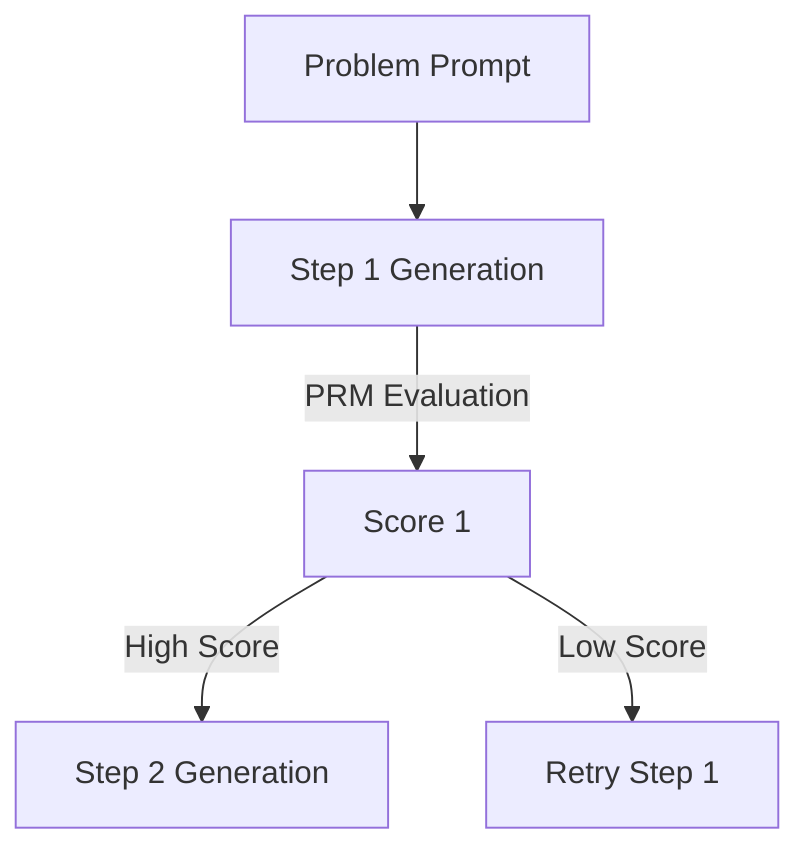

# Process-Supervised Reward Models (PRMs)

PRMs evaluate intermediate steps of reasoning rather than just the final answer, making them highly effective for multi-step reasoning tasks like math and coding.

### Key Concepts
- **Granular Supervision:** Evaluates step-by-step logic, assigning a reward or probability of correctness to each step.
- **Search Guidance:** Integrates with beam search or MCTS to select the best reasoning paths at test-time.

### System Diagram

