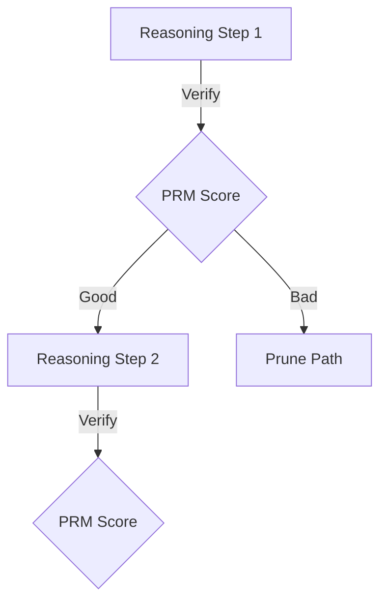

# The Process-Supervised Step Verifier Era

The step verifier era marks a transition from evaluating final outputs (Outcome-supervised Reward Models, or ORMs) to evaluating individual steps of reasoning (Process-supervised Reward Models, or PRMs) in large language models.

### Key Concepts
- **Step-by-Step Supervision:** Labeling the correctness of each intermediate step of a reasoning path.
- **Reducing Hallucinations:** By verifying intermediate steps, models can be guided along correct logical paths during test-time search.

### System Diagram

