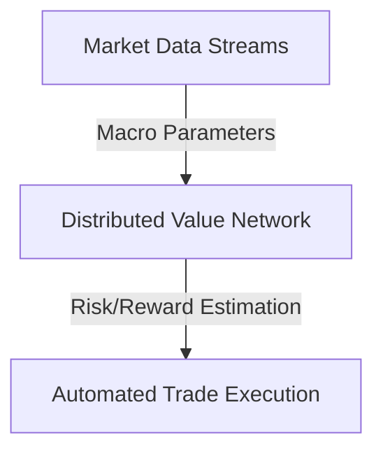

# High-Volume Quantitative Portfolio Risk Management

Distributed value networks estimate future portfolio variance and financial risk parameters under shifting macroeconomic factors.

### Key Concepts
- **Portfolio Optimization:** Estimating long-term risk-adjusted returns (Sharpe ratio) as a value function.
- **Distributed Risk Analysis:** Running parallel value evaluations across multi-asset options portfolios.

### System Diagram

