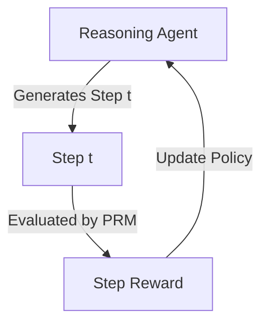

# Step-Level Alignment for Large Reasoning Models

Step-Level Alignment applies process-supervised reward feedback to language model training, teaching models to think systematically.

### Key Concepts
- **Reinforcement Learning from Process Feedback (RLPF):** Using step-level reward signals to guide policy gradient algorithms.
- **Logical Verifiers:** Automatically checking intermediate reasoning steps against formal proofs or execution environments.

### System Diagram

